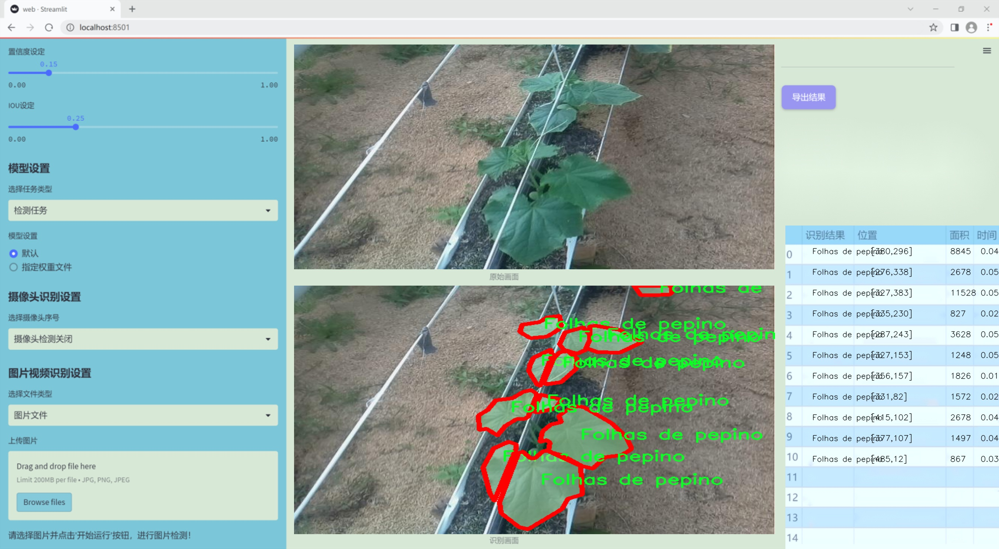
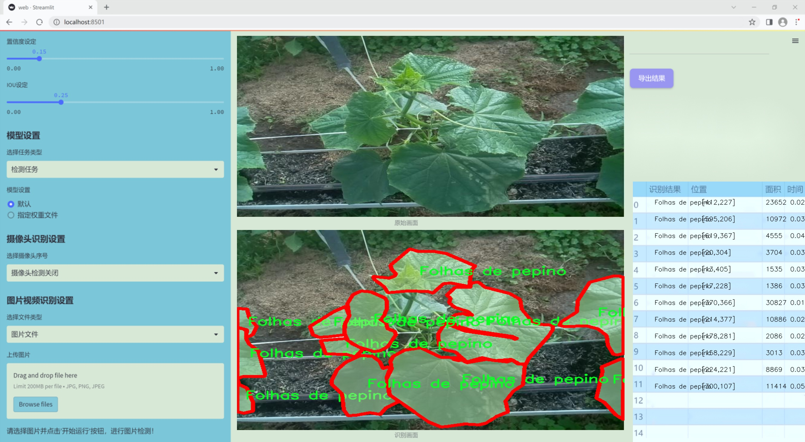
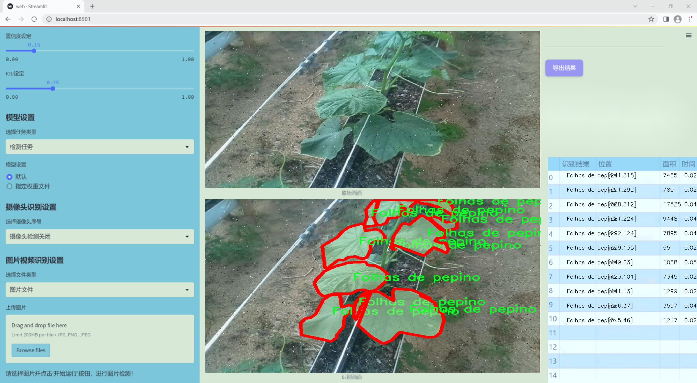
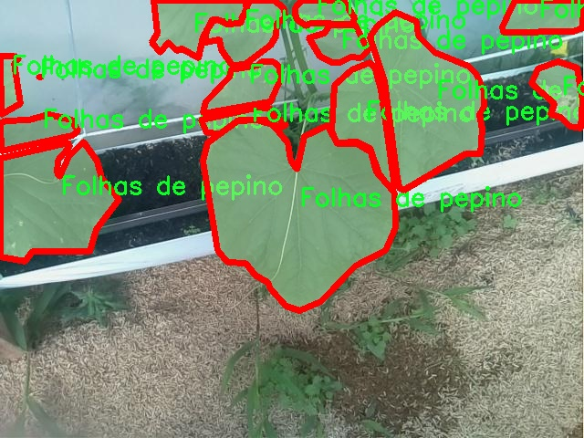
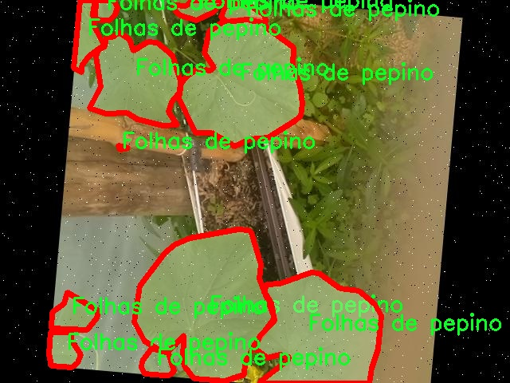
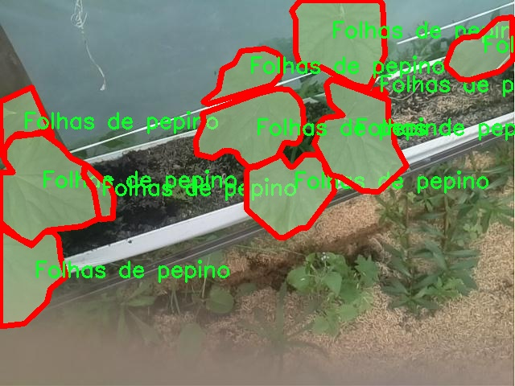
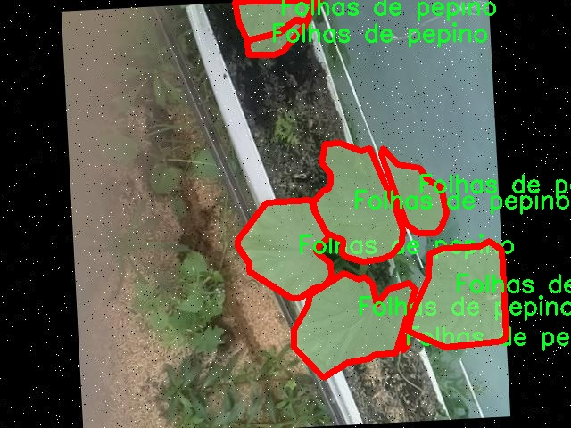
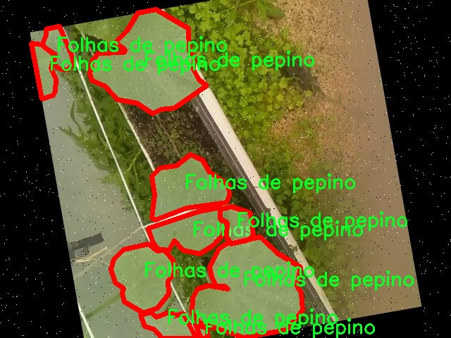

### 1.背景意义

研究背景与意义

随着全球农业现代化的推进，精准农业逐渐成为提高作物产量和质量的重要手段。在这一背景下，计算机视觉技术的应用为农作物的监测和管理提供了新的解决方案。黄瓜作为一种广泛种植的经济作物，其生长状态直接影响到农民的收益和市场供应。因此，开发高效的黄瓜叶片检测系统，能够及时识别和评估黄瓜叶片的健康状况，对于病虫害的早期预警和精准施肥、灌溉等农业管理措施具有重要意义。

本研究基于改进的YOLOv11模型，旨在构建一个高效的黄瓜叶片检测系统。该系统将利用一个包含1331张黄瓜叶片图像的数据集，数据集中仅包含一种类别“Folhas de pepino”，这使得模型的训练和优化更加专注。通过对数据集的预处理和增强，包括自动方向调整、随机旋转及噪声添加等技术，旨在提高模型的鲁棒性和准确性。采用YOLOv11模型进行检测，不仅能够实现实时性高的目标检测，还能在复杂环境中保持较好的识别效果。

此外，黄瓜叶片的健康状况与多种因素密切相关，如光照、温度和水分等，利用计算机视觉技术进行监测，可以为农民提供科学的决策依据。通过本研究的实施，期望能够为黄瓜种植提供一种新的技术手段，促进农业生产的智能化和信息化，最终实现提高作物产量和质量的目标。这不仅有助于提升农民的经济效益，也为可持续农业的发展贡献力量。

### 2.视频效果

[2.1 视频效果](https://www.bilibili.com/video/BV1wjU5YuEwd/)

### 3.图片效果







##### [项目涉及的源码数据来源链接](https://kdocs.cn/l/cszuIiCKVNis)**

注意：本项目提供训练的数据集和训练教程,由于版本持续更新,暂不提供权重文件（best.pt）,请按照6.训练教程进行训练后实现上图演示的效果。

### 4.数据集信息

##### 4.1 本项目数据集类别数＆类别名

nc: 1
names: ['Folhas de pepino']


该项目为【图像分割】数据集，请在【训练教程和Web端加载模型教程（第三步）】这一步的时候按照【图像分割】部分的教程来训练

##### 4.2 本项目数据集信息介绍

本项目数据集信息介绍

本项目所使用的数据集专注于“Cultura Pepino”，旨在为改进YOLOv11的黄瓜叶片检测系统提供强有力的支持。该数据集包含了丰富的黄瓜叶片图像，经过精心挑选和标注，以确保其在训练深度学习模型时的有效性和准确性。数据集中包含的类别数量为1，具体类别为“Folhas de pepino”，即黄瓜叶片。这一单一类别的聚焦使得模型能够在特定任务上进行深入学习，从而提高检测的精度和鲁棒性。

在数据集的构建过程中，考虑到了黄瓜叶片在不同生长阶段和环境条件下的多样性。数据集中包含了多种角度、光照条件和背景下的黄瓜叶片图像，确保模型能够适应各种实际应用场景。这种多样性不仅提高了模型的泛化能力，还增强了其在复杂环境中的表现。数据集中的图像经过严格的质量控制，确保每一张图像都具有良好的清晰度和代表性，便于模型提取有效特征。

此外，数据集的标注工作采用了先进的标注工具，确保每一张图像中的黄瓜叶片都被准确地框定和标记。这种精确的标注为模型的训练提供了坚实的基础，使得YOLOv11能够在识别和定位黄瓜叶片方面表现出色。通过对该数据集的充分利用，本项目旨在推动黄瓜叶片检测技术的发展，为农业生产提供更为高效的解决方案，最终实现精准农业的目标。











### 5.全套项目环境部署视频教程（零基础手把手教学）

[5.1 所需软件PyCharm和Anaconda安装教程（第一步）](https://www.bilibili.com/video/BV1BoC1YCEKi/?spm_id_from=333.999.0.0&vd_source=bc9aec86d164b67a7004b996143742dc)


[5.2 安装Python虚拟环境创建和依赖库安装视频教程（第二步）](https://www.bilibili.com/video/BV1ZoC1YCEBw?spm_id_from=333.788.videopod.sections&vd_source=bc9aec86d164b67a7004b996143742dc)

### 6.改进YOLOv11训练教程和Web_UI前端加载模型教程（零基础手把手教学）

[6.1 改进YOLOv11训练教程和Web_UI前端加载模型教程（第三步）](https://www.bilibili.com/video/BV1BoC1YCEhR?spm_id_from=333.788.videopod.sections&vd_source=bc9aec86d164b67a7004b996143742dc)


按照上面的训练视频教程链接加载项目提供的数据集，运行train.py即可开始训练



     Epoch   gpu_mem       box       obj       cls    labels  img_size
     1/200     20.8G   0.01576   0.01955  0.007536        22      1280: 100%|██████████| 849/849 [14:42<00:00,  1.04s/it]
               Class     Images     Labels          P          R     mAP@.5 mAP@.5:.95: 100%|██████████| 213/213 [01:14<00:00,  2.87it/s]
                 all       3395      17314      0.994      0.957      0.0957      0.0843

     Epoch   gpu_mem       box       obj       cls    labels  img_size
     2/200     20.8G   0.01578   0.01923  0.007006        22      1280: 100%|██████████| 849/849 [14:44<00:00,  1.04s/it]
               Class     Images     Labels          P          R     mAP@.5 mAP@.5:.95: 100%|██████████| 213/213 [01:12<00:00,  2.95it/s]
                 all       3395      17314      0.996      0.956      0.0957      0.0845

     Epoch   gpu_mem       box       obj       cls    labels  img_size
     3/200     20.8G   0.01561    0.0191  0.006895        27      1280: 100%|██████████| 849/849 [10:56<00:00,  1.29it/s]
               Class     Images     Labels          P          R     mAP@.5 mAP@.5:.95: 100%|███████   | 187/213 [00:52<00:00,  4.04it/s]
                 all       3395      17314      0.996      0.957      0.0957      0.0845


###### [项目数据集下载链接](https://kdocs.cn/l/cszuIiCKVNis)

### 7.原始YOLOv11算法讲解


ultralytics发布了最新的作品YOLOv11，这一次YOLOv11的变化相对于ultralytics公司的上一代作品YOLOv8变化不是很大的（YOLOv9、YOLOv10均不是ultralytics公司作品），其中改变的位置涉及到C2f变为C3K2，在SPPF后面加了一层类似于注意力机制的C2PSA，还有一个变化大家从yaml文件是看不出来的就是它的检测头内部替换了两个DWConv，以及模型的深度和宽度参数进行了大幅度调整，但是在损失函数方面就没有变化还是采用的CIoU作为边界框回归损失，下面带大家深入理解一下ultralytics最新作品YOLOv11的创新点。

**下图为最近的YOLO系列发布时间线！**


* * *

###### YOLOv11和YOLOv8对比

在YOLOYOLOv5，YOLOv8，和YOLOv11是ultralytics公司作品（ultralytics出品必属精品），下面用一张图片从yaml文件来带大家对比一下YOLOv8和YOLOv11的区别，配置文件变得内容比较少大家可以看一卡，左侧为YOLOv8右侧为YOLOv11，不同的点我用黑线标注了出来。


* * *

###### YOLOv11的网络结构解析

下面的图片为YOLOv11的网络结构图。


**其中主要创新点可以总结如下- > **

* * *

1\.
提出C3k2机制，其中C3k2有参数为c3k，其中在网络的浅层c3k设置为False（下图中可以看到c3k2第二个参数被设置为False，就是对应的c3k参数）。


此时所谓的C3k2就相当于YOLOv8中的C2f，其网络结构为一致的，其中的C3k机制的网络结构图如下图所示
**（为什么叫C3k2，我个人理解是因为C3k的调用时C3k其中的参数N固定设置为2的原因，个人理解不一定对** ）。


* * *

2\.
第二个创新点是提出C2PSA机制，这是一个C2（C2f的前身）机制内部嵌入了一个多头注意力机制，在这个过程中我还发现作者尝试了C2fPSA机制但是估计效果不如C2PSA，有的时候机制有没有效果理论上真的很难解释通，下图为C2PSA机制的原理图，仔细观察把Attention哪里去掉则C2PSA机制就变为了C2所以我上面说C2PSA就是C2里面嵌入了一个PSA机制。


* * *

3\.
第三个创新点可以说是原先的解耦头中的分类检测头增加了两个DWConv，具体的对比大家可以看下面两个图下面的是YOLOv11的解耦头，上面的是YOLOv8的解耦头.


我们上面看到了在分类检测头中YOLOv11插入了两个DWConv这样的做法可以大幅度减少参数量和计算量（原先两个普通的Conv大家要注意到卷积和是由3变为了1的，这是形成了两个深度可分离Conv），大家可能不太理解为什么加入了两个DWConv还能够减少计算量，以及什么是深度可分离Conv，下面我来解释一下。

> **`DWConv` 代表 Depthwise
> Convolution（深度卷积）**，是一种在卷积神经网络中常用的高效卷积操作。它主要用于减少计算复杂度和参数量，尤其在移动端或轻量化网络（如
> MobileNet）中十分常见。
>
> **1\. 标准卷积的计算过程**
>
> 在标准卷积操作中，对于一个输入张量（通常是一个多通道的特征图），卷积核的尺寸是 `(h, w, C_in)`，其中 `h` 和 `w`
> 是卷积核的空间尺寸，`C_in`
> 是输入通道的数量。而卷积核与输入张量做的是完整的卷积运算，每个输出通道都与所有输入通道相连并参与卷积操作，导致计算量比较大。
>
> 标准卷积的计算过程是这样的：
>
>   * 每个输出通道是所有输入通道的组合（加权求和），卷积核在每个位置都会计算与所有输入通道的点积。
>   * 假设有 `C_in` 个输入通道和 `C_out` 个输出通道，那么卷积核的总参数量是 `C_in * C_out * h * w`。
>

>
> 2\. **Depthwise Convolution（DWConv）**
>
> 与标准卷积不同， **深度卷积** 将输入的每个通道单独处理，即 **每个通道都有自己的卷积核进行卷积**
> ，不与其他通道进行交互。它可以被看作是标准卷积的一部分，专注于空间维度上的卷积运算。
>
> **深度卷积的计算过程：**
>
>   * 假设输入张量有 `C_in` 个通道，每个通道会使用一个 `h × w`
> 的卷积核进行卷积操作。这个过程称为“深度卷积”，因为每个通道独立进行卷积运算。
>   * 输出的通道数与输入通道数一致，每个输出通道只和对应的输入通道进行卷积，没有跨通道的组合。
>   * 参数量和计算量相比标准卷积大大减少，卷积核的参数量是 `C_in * h * w`。
>

>
> **深度卷积的优点：**
>
>   1. **计算效率高** ：相对于标准卷积，深度卷积显著减少了计算量。它只处理空间维度上的卷积，不再处理通道间的卷积。
>   2.  **参数量减少** ：由于每个卷积核只对单个通道进行卷积，参数量大幅减少。例如，标准卷积的参数量为 `C_in * C_out * h *
> w`，而深度卷积的参数量为 `C_in * h * w`。
>   3.  **结合点卷积可提升效果** ：为了弥补深度卷积缺乏跨通道信息整合的问题，通常深度卷积后会配合 `1x1` 的点卷积（Pointwise
> Convolution）使用，通过 `1x1` 的卷积核整合跨通道的信息。这种组合被称为 **深度可分离卷积** （Depthwise
> Separable Convolution） | **这也是我们本文YOLOv11中的做法** 。
>

>
> 3\. **深度卷积与标准卷积的区别**
>
> 操作类型| 卷积核大小| 输入通道数| 输出通道数| 参数量  
> ---|---|---|---|---  
> 标准卷积| `h × w`| `C_in`| `C_out`| `C_in * C_out * h * w`  
> 深度卷积（DWConv）| `h × w`| `C_in`| `C_in`| `C_in * h * w`  
>  
> 可以看出，深度卷积在相同的卷积核大小下，参数量减少了约 `C_out` 倍
> （细心的人可以发现用最新版本的ultralytics仓库运行YOLOv8参数量相比于之前的YOLOv8以及大幅度减少了这就是因为检测头改了的原因但是名字还是Detect，所以如果你想继续用YOLOv8发表论文做实验那么不要更新最近的ultralytics仓库）。
>
> **4\. 深度可分离卷积 (Depthwise Separable Convolution)**
>
> 深度卷积常与 `1x1` 的点卷积配合使用，这称为深度可分离卷积。其过程如下：
>
>   1. 先对输入张量进行深度卷积，对每个通道独立进行空间卷积。
>   2. 然后通过 `1x1` 点卷积，对通道维度进行混合，整合不同通道的信息。
>

>
> 这样既可以保证计算量的减少，又可以保持跨通道的信息流动。
>
> 5\. **总结**
>
> `DWConv` 是一种高效的卷积方式，通过单独处理每个通道来减少计算量，结合 `1x1`
> 的点卷积，形成深度可分离卷积，可以在保持网络性能的同时极大地减少模型的计算复杂度和参数量。

**看到这里大家应该明白了为什么加入了两个DWConv还能减少参数量以及YOLOv11的检测头创新点在哪里。**

* * *

##### YOLOv11和YOLOv8还有一个不同的点就是其各个版本的模型（N - S - M- L - X）网络深度和宽度变了


可以看到在深度（depth）和宽度
（width）两个地方YOLOv8和YOLOv11是基本上完全不同了，这里我理解这么做的含义就是模型网络变小了，所以需要加深一些模型的放缩倍数来弥补模型之前丧失的能力从而来达到一个平衡。

> **本章总结：**
> YOLOv11的改进点其实并不多更多的都是一些小的结构上的创新，相对于之前的YOLOv5到YOLOv8的创新，其实YOLOv11的创新点不算多，但是其是ultralytics公司的出品，同时ultralytics仓库的使用量是非常多的（不像YOLOv9和YOLOv10）所以在未来的很长一段时间内其实YOLO系列估计不会再更新了，YOLOv11作为最新的SOTA肯定是十分适合大家来发表论文和创新的。
>

### 8.200+种全套改进YOLOV11创新点原理讲解

#### 8.1 200+种全套改进YOLOV11创新点原理讲解大全

由于篇幅限制，每个创新点的具体原理讲解就不全部展开，具体见下列网址中的改进模块对应项目的技术原理博客网址【Blog】（创新点均为模块化搭建，原理适配YOLOv5~YOLOv11等各种版本）

[改进模块技术原理博客【Blog】网址链接](https://gitee.com/qunmasj/good)


#### 8.2 精选部分改进YOLOV11创新点原理讲解

###### 这里节选部分改进创新点展开原理讲解(完整的改进原理见上图和[改进模块技术原理博客链接](https://gitee.com/qunmasj/good)【如果此小节的图加载失败可以通过CSDN或者Github搜索该博客的标题访问原始博客，原始博客图片显示正常】


### D-LKA Attention简介
自2010年代中期以来，卷积神经网络（CNNs）已成为许多计算机视觉应用的首选技术。它们能够从原始数据中自动提取复杂的特征表示，无需手动进行特征工程，这引起了医学图像分析社区的极大兴趣。许多成功的CNN架构，如U-Net、全卷积网络、DeepLab或SegCaps（分割胶囊），已经被开发出来。这些架构在语义分割任务中取得了巨大成功，先前的最新方法已经被超越。

在计算机视觉研究中，不同尺度下的目标识别是一个关键问题。在CNN中，可检测目标的大小与相应网络层的感受野尺寸密切相关。如果一个目标扩展到超出这个感受野的边界，这可能会导致欠分割结果。相反，与目标实际大小相比使用过大的感受野可能会限制识别，因为背景信息可能会对预测产生不必要的影响。

解决这个问题的一个有希望的方法涉及在并行使用具有不同尺寸的多个Kernel，类似于Inception块的机制。然而，由于参数和计算要求的指数增长，将Kernel大小增加以容纳更大的目标在实践中受到限制。因此，出现了各种策略，包括金字塔池化技术和不同尺度的扩张卷积，以捕获多尺度的上下文信息。

另一个直观的概念涉及将多尺度图像金字塔或它们的相关特征表示直接纳入网络架构。然而，这种方法存在挑战，特别是在管理训练和推理时间方面的可行性方面存在挑战。在这个背景下，使用编码器-解码器网络，如U-Net，已被证明是有利的。这样的网络在较浅的层中编码外观和位置，而在更深的层中，通过神经元的更广泛的感受野捕获更高的语义信息和上下文信息。

一些方法将来自不同层的特征组合在一起，或者预测来自不同尺寸的层的特征以使用多尺度的信息。此外，出现了从不同尺度的层中预测特征的方法，有效地实现了跨多个尺度的见解整合。然而，大多数编码器-解码器结构面临一个挑战：它们经常无法在不同尺度之间保持一致的特征，并主要使用最后一个解码器层生成分割结果。

语义分割是一项任务，涉及根据预定义的标签集为图像中的每个像素预测语义类别。这项任务要求提取高级特征同时保留初始的空间分辨率。CNNs非常适合捕获局部细节和低级信息，尽管以忽略全局上下文为代价。视觉Transformer（ViT）架构已经成为解决处理全局信息的视觉任务的关键，包括语义分割，取得了显著的成功。

ViT的基础是注意力机制，它有助于在整个输入序列上聚合信息。这种能力使网络能够合并远程的上下文提示，超越了CNN的有限感受野尺寸。然而，这种策略通常会限制ViT有效建模局部信息的能力。这种局限可能会妨碍它们检测局部纹理的能力，这对于各种诊断和预测任务至关重要。这种缺乏局部表示可以归因于ViT模型处理图像的特定方式。

ViT模型将图像分成一系列Patch，并使用自注意力机制来模拟它们之间的依赖关系。这种方法可能不如CNN模型中的卷积操作对感受野内提取局部特征有效。ViT和CNN模型之间的这种图像处理方法的差异可能解释了CNN模型在局部特征提取方面表现出色的原因。

近年来，已经开发出创新性方法来解决Transformer模型内部局部纹理不足的问题。其中一种方法是通过互补方法将CNN和ViT特征结合起来，以结合它们的优势并减轻局部表示的不足。TransUNet是这种方法的早期示例，它在CNN的瓶颈中集成了Transformer层，以模拟局部和全局依赖关系。HiFormer提出了一种解决方案，将Swin Transformer模块和基于CNN的编码器结合起来，生成两个多尺度特征表示，通过Double-Level Fusion模块集成。UNETR使用基于Transformer的编码器和CNN解码器进行3D医学图像分割。CoTr和TransBTS通过Transformer在低分辨率阶段增强分割性能，将CNN编码器和解码器连接在一起。

增强局部特征表示的另一种策略是重新设计纯Transformer模型内部的自注意力机制。在这方面，Swin-Unet在U形结构中集成了一个具有线性计算复杂性的Swin Transformer块作为多尺度 Backbone 。MISSFormer采用高效Transformer来解决视觉Transformer中的参数问题，通过在输入块上进行不可逆的降采样操作。D-Former引入了一个纯Transformer的管道，具有双重注意模块，以分段的方式捕获细粒度的局部注意和与多元单元的交互。然而，仍然存在一些特定的限制，包括计算效率低下，如TransUNet模型所示，对CNN Backbone 的严重依赖，如HiFormer所观察到的，以及对多尺度信息的忽略。

此外，目前的分割架构通常采用逐层处理3D输入 volumetric 的方法，无意中忽视了相邻切片之间的潜在相关性。这一疏忽限制了对 volumetric 信息的全面利用，因此损害了定位精度和上下文集成。此外，必须认识到，医学领域的病变通常在形状上发生变形。因此，用于医学图像分析的任何学习算法都必须具备捕捉和理解这些变形的能力。与此同时，该算法应保持计算效率，以便处理3D volumetric数据。

为了解决上述提到的挑战，作者提出了一个解决方案，即可变形大卷积核注意力模块（Deformable LKA module），它是作者网络设计的基本构建模块。这个模块明确设计成在有效处理上下文信息的同时保留局部描述符。作者的架构在这两个方面的平衡增强了实现精确语义分割的能力。

值得注意的是，参考该博客引入了一种基于数据的感受野的动态适应，不同于传统卷积操作中的固定滤波器Mask。这种自适应方法使作者能够克服与静态方法相关的固有限制。这种创新方法还扩展到了D-LKA Net架构的2D和3D版本的开发。

在3D模型的情况下，D-LKA机制被量身定制以适应3D环境，从而实现在不同 volumetric 切片之间无缝信息交互。最后，作者的贡献通过其计算效率得到进一步强调。作者通过仅依靠D-LKA概念的设计来实现这一点，在各种分割基准上取得了显著的性能，确立了作者的方法作为一种新的SOTA方法。

在本节中，作者首先概述方法论。首先，作者回顾了由Guo等人引入的大卷积核注意力（Large Kernel Attention，LKA）的概念。然后，作者介绍了作者对可变形LKA模块的创新探索。在此基础上，作者介绍了用于分割任务的2D和3D网络架构。

大卷积核提供了与自注意力机制类似的感受野。可以通过使用深度卷积、深度可扩展卷积和卷积来构建大卷积核，从而减少了参数和计算量。构建输入维度为和通道数的卷积核的深度卷积和深度可扩展卷积的卷积核大小的方程如下：


具有卷积核大小和膨胀率。参数数量和浮点运算（FLOPs）的计算如下：


FLOPs的数量与输入图像的大小成线性增长。参数的数量随通道数和卷积核大小的增加而呈二次增长。然而，由于它们通常都很小，因此它们不是限制因素。

为了最小化对于固定卷积核大小K的参数数量，可以将方程3对于膨胀率的导数设定为零：


例如，当卷积核大小为时，结果是。将这些公式扩展到3D情况是直接的。对于大小为和通道数C的输入，3D情况下参数数量和FLOPs 的方程如下：


具有卷积核大小和膨胀。


利用大卷积核进行医学图像分割的概念通过引入可变形卷积得以扩展。可变形卷积可以通过整数偏移自由调整采样网格以进行自由变形。额外的卷积层从特征图中学习出变形，从而创建一个偏移场。基于特征本身学习变形会导致自适应卷积核。这种灵活的卷积核形状可以提高病变或器官变形的表示，从而增强了目标边界的定义。

负责计算偏移的卷积层遵循其相应卷积层的卷积核大小和膨胀。双线性插值用于计算不在图像网格上的偏移的像素值。如图2所示，D-LKA模块可以表示为：


其中输入特征由表示，。表示为注意力图，其中每个值表示相应特征的相对重要性。运算符  表示逐元素乘法运算。值得注意的是，LKA不同于传统的注意力方法，它不需要额外的规范化函数，如或。这些规范化函数往往忽视高频信息，从而降低了基于自注意力的方法的性能。

在该方法的2D版本中，卷积层被可变形卷积所替代，因为可变形卷积能够改善对具有不规则形状和大小的目标的捕捉能力。这些目标在医学图像数据中常常出现，因此这种增强尤为重要。

然而，将可变形LKA的概念扩展到3D领域会带来一定的挑战。主要的约束来自于需要用于生成偏移的额外卷积层。与2D情况不同，由于输入和输出通道的性质，这一层无法以深度可分的方式执行。在3D环境中，输入通道对应于特征，而输出通道扩展到，其中是卷积核的大小。大卷积核的复杂性导致沿第3D的通道数扩展，导致参数和FLOPs大幅增加。因此，针对3D情况采用了另一种替代方法。在现有的LKA框架中，深度卷积之后引入了一个单独的可变形卷积层。这种战略性的设计调整旨在减轻扩展到3D领域所带来的挑战。


2D网络的架构如图1所示。第一变种使用MaxViT作为编码器组件，用于高效特征提取，而第二变种则结合可变形LKA层进行更精细、卓越的分割。

在更正式的描述中，编码器生成4个分层输出表示。首先，卷积干扰将输入图像的维度减小到。随后，通过4个MaxViT块的4个阶段进行特征提取，每个阶段后跟随降采样层。随着过程进展到解码器，实施了4个阶段的D-LKA层，每个阶段包含2个D-LKA块。然后，应用Patch扩展层以实现分辨率上采样，同时减小通道维度。最后，线性层负责生成最终的输出。

2D D-LKA块的结构包括LayerNorm、可变形LKA和多层感知器（MLP）。积分残差连接确保了有效的特征传播，即使在更深层也是如此。这个安排可以用数学方式表示为：


其中输入特征，层归一化LN，可变形LKA注意力，深度卷积，线性层和GeLU激活函数。

3D网络架构如图1所示，采用编码器-解码器设计进行分层结构化。首先，一个Patch嵌入层将输入图像的维度从（）减小到（）。在编码器中，采用了3个D-LKA阶段的序列，每个阶段包含3个D-LKA块。在每个阶段之后，通过降采样步骤将空间分辨率减半，同时将通道维度加倍。中央瓶颈包括另一组2个D-LKA块。解码器结构与编码器相对称。

为了将特征分辨率加倍，同时减少通道数，使用转置卷积。每个解码器阶段都使用3个D-LKA块来促进远距离特征依赖性。最终的分割输出由一个卷积层产生，后面跟随一个卷积层以匹配特定类别的通道要求。

为了建立输入图像和分割输出之间的直接连接，使用卷积形成了一个跳跃连接。额外的跳跃连接根据简单的加法对来自其他阶段的特征进行融合。最终的分割图是通过和卷积层的组合产生的。

3D D-LKA块包括层归一化，后跟D-LKA注意力，应用了残差连接的部分。随后的部分采用了一个卷积层，后面跟随一个卷积层，两者都伴随着残差连接。这个整个过程可以总结如下：


带有输入特征 、层归一化 、可变形 LKA 、卷积层 和输出特征 的公式。是指一个前馈网络，包括2个卷积层和激活函数。

表7显示了普通卷积和构建卷积的参数数量比较。尽管标准卷积的参数数量在通道数较多时急剧增加，但分解卷积的参数总体较低，并且增长速度不那么快。

与分解卷积相比，可变形分解卷积增加了大量参数，但仍然明显小于标准卷积。可变形卷积的主要参数是由偏移网络创建的。在这里，作者假设可变形深度卷积的Kernel大小为（5,5），可变形深度空洞卷积的Kernel大小为（7,7）。这导致了21×21大小的大Kernel的最佳参数数量。更高效地生成偏移量的方法将大大减少参数数量。


值得注意的是，引入可变形LKA确实会增加模型的参数数量和每秒的浮点运算次数（FLOPS）。然而，重要的是强调，这增加的计算负载不会影响作者模型的整体推理速度。

相反，对于Batch-size > 1，作者甚至观察到推理时间的减少，如图7所示。例如，基于作者的广泛实验，作者观察到对于Batch-size为16，具有可变形卷积和没有可变形卷积的推理时间分别为8.01毫秒和17.38毫秒。作者认为这是由于在2D中对可变形卷积的高效实现所致。为了测量时间，使用了大小为（）的随机输入。在GPU热身周期50次迭代之后，网络被推断了1000次。测量是在NVIDIA RTX 3090 GPU上进行的。


为了充分利用性能与参数之间的权衡关系，作者在图8中可视化了在Synapse 2D数据集上报告的DSC和HD性能以及基于参数数量的内存消耗。D-LKA Net引入了相当多的参数，约为101M。这比性能第二好的方法ScaleFormer使用的111.6M参数要少。

与更轻量级的DAEFormer模型相比，作者实现了更好的性能，这证明了参数增加的合理性。大多数参数来自于MaxViT编码器；因此，将编码器替换为更高效的编码器可以减少模型参数。值得注意的是，在此可视化中，作者最初将HD和内存值都归一化到[0, 100]范围内。随后，作者将它们从100缩小，以增强更高值的表示。


### 9.系统功能展示

图9.1.系统支持检测结果表格显示

  图9.2.系统支持置信度和IOU阈值手动调节

  图9.3.系统支持自定义加载权重文件best.pt(需要你通过步骤5中训练获得)

  图9.4.系统支持摄像头实时识别

  图9.5.系统支持图片识别

  图9.6.系统支持视频识别

  图9.7.系统支持识别结果文件自动保存

  图9.8.系统支持Excel导出检测结果数据


### 10. YOLOv11核心改进源码讲解

#### 10.1 transformer.py

以下是对给定代码的核心部分进行提炼和详细注释的结果：

```python
import torch
import torch.nn as nn
from functools import partial

# 导入自定义的模块
from .prepbn import RepBN, LinearNorm
from ..modules.transformer import TransformerEncoderLayer

# 定义公开的模块名称
__all__ = ['AIFI_RepBN']

# 定义线性归一化的函数，使用 LayerNorm 和 RepBN 作为归一化方法
ln = nn.LayerNorm
linearnorm = partial(LinearNorm, norm1=ln, norm2=RepBN, step=60000)

class TransformerEncoderLayer_RepBN(TransformerEncoderLayer):
    """自定义的 Transformer 编码器层，使用 RepBN 进行归一化。"""
    
    def __init__(self, c1, cm=2048, num_heads=8, dropout=0, act=..., normalize_before=False):
        # 初始化父类
        super().__init__(c1, cm, num_heads, dropout, act, normalize_before)
        
        # 使用自定义的线性归一化
        self.norm1 = linearnorm(c1)
        self.norm2 = linearnorm(c1)

class AIFI_RepBN(TransformerEncoderLayer_RepBN):
    """定义 AIFI Transformer 层。"""

    def __init__(self, c1, cm=2048, num_heads=8, dropout=0, act=nn.GELU(), normalize_before=False):
        """初始化 AIFI 实例，设置参数。"""
        super().__init__(c1, cm, num_heads, dropout, act, normalize_before)

    def forward(self, x):
        """AIFI Transformer 层的前向传播。"""
        c, h, w = x.shape[1:]  # 获取输入的通道数、高度和宽度
        pos_embed = self.build_2d_sincos_position_embedding(w, h, c)  # 构建位置嵌入
        
        # 将输入张量从 [B, C, H, W] 变形为 [B, HxW, C]
        x = super().forward(x.flatten(2).permute(0, 2, 1), pos=pos_embed.to(device=x.device, dtype=x.dtype))
        
        # 将输出变形回 [B, C, H, W] 格式
        return x.permute(0, 2, 1).view([-1, c, h, w]).contiguous()

    @staticmethod
    def build_2d_sincos_position_embedding(w, h, embed_dim=256, temperature=10000.0):
        """构建 2D 正弦-余弦位置嵌入。"""
        assert embed_dim % 4 == 0, "嵌入维度必须是 4 的倍数，以便进行 2D 正弦-余弦位置嵌入"
        
        # 创建宽度和高度的网格
        grid_w = torch.arange(w, dtype=torch.float32)
        grid_h = torch.arange(h, dtype=torch.float32)
        grid_w, grid_h = torch.meshgrid(grid_w, grid_h, indexing="ij")
        
        pos_dim = embed_dim // 4  # 计算位置维度
        omega = torch.arange(pos_dim, dtype=torch.float32) / pos_dim
        omega = 1.0 / (temperature**omega)  # 计算频率

        # 计算宽度和高度的正弦和余弦嵌入
        out_w = grid_w.flatten()[..., None] @ omega[None]
        out_h = grid_h.flatten()[..., None] @ omega[None]

        # 返回拼接后的正弦和余弦嵌入
        return torch.cat([torch.sin(out_w), torch.cos(out_w), torch.sin(out_h), torch.cos(out_h)], 1)[None]
```

### 代码核心部分及注释说明：
1. **模块导入**：导入必要的 PyTorch 模块和自定义模块。
2. **归一化设置**：使用 `LayerNorm` 和 `RepBN` 进行归一化的定义。
3. **TransformerEncoderLayer_RepBN**：自定义的 Transformer 编码器层，重写了初始化方法以使用自定义的归一化。
4. **AIFI_RepBN**：继承自 `TransformerEncoderLayer_RepBN`，实现了 AIFI Transformer 层的前向传播逻辑。
5. **前向传播**：处理输入数据，构建位置嵌入，并进行数据变形。
6. **位置嵌入构建**：实现了 2D 正弦-余弦位置嵌入的生成，确保嵌入维度的有效性，并计算频率。

这些核心部分构成了 AIFI Transformer 层的基本结构和功能。

这个程序文件定义了一个基于Transformer架构的模块，主要是实现了一个名为AIFI_RepBN的Transformer编码层。首先，文件导入了必要的PyTorch库以及一些自定义的模块和函数。

在这个文件中，首先定义了一个`linearnorm`，它是一个部分应用的函数，结合了`LinearNorm`和`RepBN`，并设定了一个步长参数。接着，定义了一个名为`TransformerEncoderLayer_RepBN`的类，这个类继承自`TransformerEncoderLayer`，并在初始化时调用父类的构造函数。这个类中包含了两个归一化层`norm1`和`norm2`，它们都是通过`linearnorm`创建的。

然后，定义了`AIFI_RepBN`类，它继承自`TransformerEncoderLayer_RepBN`，并且实现了AIFI变换层的功能。在其构造函数中，除了调用父类的构造函数外，还可以指定激活函数，默认为GELU。 

在`AIFI_RepBN`类中，最重要的方法是`forward`，这个方法实现了前向传播的逻辑。首先，它获取输入张量的形状信息，并通过`build_2d_sincos_position_embedding`方法生成二维的正弦余弦位置嵌入。接着，它将输入张量从形状[B, C, H, W]展平为[B, HxW, C]，并调用父类的`forward`方法进行处理，最后将输出结果重新调整为原来的形状[B, C, H, W]。

`build_2d_sincos_position_embedding`是一个静态方法，用于构建二维的正弦余弦位置嵌入。该方法首先检查嵌入维度是否可以被4整除，然后生成宽度和高度的网格，并计算相应的正弦和余弦值。最终返回一个包含这些位置嵌入的张量。

整体来看，这个文件实现了一个增强的Transformer编码层，结合了位置嵌入和特定的归一化方法，适用于处理图像等具有空间结构的数据。

#### 10.2 ui.py

以下是保留的核心代码部分，并添加了详细的中文注释：

```python
import sys
import subprocess

def run_script(script_path):
    """
    使用当前 Python 环境运行指定的脚本。

    Args:
        script_path (str): 要运行的脚本路径

    Returns:
        None
    """
    # 获取当前 Python 解释器的路径
    python_path = sys.executable

    # 构建运行命令，使用 streamlit 运行指定的脚本
    command = f'"{python_path}" -m streamlit run "{script_path}"'

    # 执行命令，并等待其完成
    result = subprocess.run(command, shell=True)
    
    # 检查命令执行的返回码，如果不为0则表示出错
    if result.returncode != 0:
        print("脚本运行出错。")

# 实例化并运行应用
if __name__ == "__main__":
    # 指定要运行的脚本路径
    script_path = "web.py"  # 这里可以替换为实际的脚本路径

    # 调用函数运行指定的脚本
    run_script(script_path)
```

### 代码说明：
1. **导入模块**：
   - `sys`：用于访问与 Python 解释器相关的变量和函数。
   - `subprocess`：用于创建新进程、连接到它们的输入/输出/错误管道，并获得返回码。

2. **`run_script` 函数**：
   - 接收一个脚本路径作为参数，并使用当前 Python 环境运行该脚本。
   - 使用 `sys.executable` 获取当前 Python 解释器的路径。
   - 构建一个命令字符串，使用 `streamlit` 模块运行指定的脚本。
   - 使用 `subprocess.run` 执行构建的命令，并等待其完成。
   - 检查命令的返回码，如果返回码不为0，表示脚本运行出错，并打印错误信息。

3. **主程序部分**：
   - 使用 `if __name__ == "__main__":` 确保只有在直接运行该脚本时才会执行以下代码。
   - 指定要运行的脚本路径（在这里是 `web.py`）。
   - 调用 `run_script` 函数来运行指定的脚本。

这个程序文件名为 `ui.py`，主要功能是通过当前的 Python 环境来运行一个指定的脚本。代码首先导入了必要的模块，包括 `sys`、`os` 和 `subprocess`，以及一个自定义的路径处理函数 `abs_path`，这个函数可能用于获取脚本的绝对路径。

在 `run_script` 函数中，程序接受一个参数 `script_path`，这个参数是要运行的脚本的路径。函数首先获取当前 Python 解释器的路径，这样可以确保使用正确的 Python 环境来执行脚本。接着，程序构建了一个命令字符串，使用 `streamlit` 来运行指定的脚本。`streamlit` 是一个用于构建数据应用的框架。

然后，程序使用 `subprocess.run` 方法来执行这个命令。这个方法会在一个新的进程中运行命令，并等待其完成。如果命令执行的返回码不为零，表示脚本运行出错，程序会输出一条错误信息。

在文件的最后部分，使用 `if __name__ == "__main__":` 语句来确保只有在直接运行这个文件时才会执行下面的代码。程序指定了一个脚本路径 `web.py`，并调用 `run_script` 函数来运行这个脚本。

总体来说，这个程序的目的是为了方便地通过 Python 环境运行一个名为 `web.py` 的脚本，并处理可能出现的错误。

#### 10.3 mamba_yolo.py

以下是经过简化和注释的核心代码部分，主要包括`LayerNorm2d`、`CrossScan`、`CrossMerge`、`SelectiveScanCore`、`cross_selective_scan`、`SS2D`、`XSSBlock`和`VSSBlock_YOLO`类。

```python
import torch
import torch.nn as nn
from functools import partial

class LayerNorm2d(nn.Module):
    """自定义的二维层归一化模块"""
    def __init__(self, normalized_shape, eps=1e-6, elementwise_affine=True):
        super().__init__()
        # 使用nn.LayerNorm进行归一化
        self.norm = nn.LayerNorm(normalized_shape, eps, elementwise_affine)

    def forward(self, x):
        # 将输入的形状从 (B, C, H, W) 转换为 (B, H, W, C)
        x = x.permute(0, 2, 3, 1).contiguous()
        x = self.norm(x)  # 进行归一化
        # 再将形状转换回 (B, C, H, W)
        return x.permute(0, 3, 1, 2).contiguous()

class CrossScan(torch.autograd.Function):
    """交叉扫描操作的自定义函数"""
    @staticmethod
    def forward(ctx, x: torch.Tensor):
        B, C, H, W = x.shape
        ctx.shape = (B, C, H, W)
        xs = x.new_empty((B, 4, C, H * W))  # 创建一个新的张量
        xs[:, 0] = x.flatten(2, 3)  # 展平 H 和 W 维度
        xs[:, 1] = x.transpose(dim0=2, dim1=3).flatten(2, 3)  # 转置并展平
        xs[:, 2:4] = torch.flip(xs[:, 0:2], dims=[-1])  # 翻转
        return xs

    @staticmethod
    def backward(ctx, ys: torch.Tensor):
        B, C, H, W = ctx.shape
        L = H * W
        # 反向传播
        ys = ys[:, 0:2] + ys[:, 2:4].flip(dims=[-1]).view(B, 2, -1, L)
        y = ys[:, 0] + ys[:, 1].view(B, -1, W, H).transpose(dim0=2, dim1=3).contiguous().view(B, -1, L)
        return y.view(B, -1, H, W)

class CrossMerge(torch.autograd.Function):
    """交叉合并操作的自定义函数"""
    @staticmethod
    def forward(ctx, ys: torch.Tensor):
        B, K, D, H, W = ys.shape
        ctx.shape = (H, W)
        ys = ys.view(B, K, D, -1)
        ys = ys[:, 0:2] + ys[:, 2:4].flip(dims=[-1]).view(B, 2, D, -1)
        y = ys[:, 0] + ys[:, 1].view(B, -1, W, H).transpose(dim0=2, dim1=3).contiguous().view(B, D, -1)
        return y

    @staticmethod
    def backward(ctx, x: torch.Tensor):
        H, W = ctx.shape
        B, C, L = x.shape
        xs = x.new_empty((B, 4, C, L))
        xs[:, 0] = x
        xs[:, 1] = x.view(B, C, H, W).transpose(dim0=2, dim1=3).flatten(2, 3)
        xs[:, 2:4] = torch.flip(xs[:, 0:2], dims=[-1])
        xs = xs.view(B, 4, C, H, W)
        return xs, None, None

class SelectiveScanCore(torch.autograd.Function):
    """选择性扫描的核心操作"""
    @staticmethod
    @torch.cuda.amp.custom_fwd
    def forward(ctx, u, delta, A, B, C, D=None, delta_bias=None, delta_softplus=False, nrows=1, backnrows=1):
        # 确保输入张量是连续的
        if u.stride(-1) != 1:
            u = u.contiguous()
        if delta.stride(-1) != 1:
            delta = delta.contiguous()
        if D is not None and D.stride(-1) != 1:
            D = D.contiguous()
        if B.stride(-1) != 1:
            B = B.contiguous()
        if C.stride(-1) != 1:
            C = C.contiguous()
        if B.dim() == 3:
            B = B.unsqueeze(dim=1)
            ctx.squeeze_B = True
        if C.dim() == 3:
            C = C.unsqueeze(dim=1)
            ctx.squeeze_C = True
        ctx.delta_softplus = delta_softplus
        ctx.backnrows = backnrows
        # 调用CUDA核心进行前向计算
        out, x, *rest = selective_scan_cuda_core.fwd(u, delta, A, B, C, D, delta_bias, delta_softplus, 1)
        ctx.save_for_backward(u, delta, A, B, C, D, delta_bias, x)
        return out

    @staticmethod
    @torch.cuda.amp.custom_bwd
    def backward(ctx, dout, *args):
        u, delta, A, B, C, D, delta_bias, x = ctx.saved_tensors
        if dout.stride(-1) != 1:
            dout = dout.contiguous()
        # 调用CUDA核心进行反向计算
        du, ddelta, dA, dB, dC, dD, ddelta_bias, *rest = selective_scan_cuda_core.bwd(
            u, delta, A, B, C, D, delta_bias, dout, x, ctx.delta_softplus, 1
        )
        return (du, ddelta, dA, dB, dC, dD, ddelta_bias, None, None, None, None)

def cross_selective_scan(x: torch.Tensor, x_proj_weight: torch.Tensor, dt_projs_weight: torch.Tensor, A_logs: torch.Tensor, Ds: torch.Tensor, out_norm: nn.Module = None):
    """交叉选择性扫描的实现"""
    B, D, H, W = x.shape
    L = H * W

    # 调用CrossScan进行交叉扫描
    xs = CrossScan.apply(x)

    # 进行投影和计算
    x_dbl = torch.einsum("b k d l, k c d -> b k c l", xs, x_proj_weight)
    dts, Bs, Cs = torch.split(x_dbl, [R, N, N], dim=2)
    dts = torch.einsum("b k r l, k d r -> b k d l", dts, dt_projs_weight)
    xs = xs.view(B, -1, L)
    dts = dts.contiguous().view(B, -1, L)

    # 计算A和D的值
    As = -torch.exp(A_logs.to(torch.float))
    Bs = Bs.contiguous()
    Cs = Cs.contiguous()
    Ds = Ds.to(torch.float)
    delta_bias = dt_projs_bias.view(-1).to(torch.float)

    # 进行选择性扫描
    ys: torch.Tensor = selective_scan(xs, dts, As, Bs, Cs, Ds, delta_bias, delta_softplus).view(B, K, -1, H, W)

    # 进行交叉合并
    y: torch.Tensor = CrossMerge.apply(ys)

    # 进行输出归一化
    if out_norm is not None:
        y = out_norm(y.view(B, -1, H, W)).permute(0, 2, 3, 1)

    return y

class SS2D(nn.Module):
    """SS2D模块的实现"""
    def __init__(self, d_model=96, d_state=16, ssm_ratio=2.0, ssm_rank_ratio=2.0, dt_rank="auto", act_layer=nn.SiLU, dropout=0.0):
        super().__init__()
        self.d_model = d_model
        self.d_state = d_state
        self.ssm_ratio = ssm_ratio
        self.ssm_rank_ratio = ssm_rank_ratio
        self.dt_rank = dt_rank

        # 输入投影层
        self.in_proj = nn.Conv2d(d_model, int(ssm_ratio * d_model), kernel_size=1, bias=False)
        self.act = act_layer()

        # 输出投影层
        self.out_proj = nn.Conv2d(int(ssm_ratio * d_model), d_model, kernel_size=1, bias=False)
        self.dropout = nn.Dropout(dropout)

    def forward(self, x: torch.Tensor):
        x = self.in_proj(x)  # 输入投影
        x = self.act(x)  # 激活
        x = self.dropout(x)  # Dropout
        return self.out_proj(x)  # 输出投影

class XSSBlock(nn.Module):
    """XSSBlock模块的实现"""
    def __init__(self, in_channels: int, hidden_dim: int, n: int, ssm_d_state: int = 16):
        super().__init__()
        self.in_proj = nn.Conv2d(in_channels, hidden_dim, kernel_size=1, bias=False)
        self.ss2d = nn.Sequential(*(SS2D(d_model=hidden_dim, d_state=ssm_d_state) for _ in range(n)))

    def forward(self, input: torch.Tensor):
        input = self.in_proj(input)  # 输入投影
        x = self.ss2d(input)  # SSM处理
        return input + x  # 残差连接

class VSSBlock_YOLO(nn.Module):
    """VSSBlock_YOLO模块的实现"""
    def __init__(self, in_channels: int, hidden_dim: int, drop_path: float = 0):
        super().__init__()
        self.proj_conv = nn.Conv2d(in_channels, hidden_dim, kernel_size=1, bias=True)
        self.ss_block = XSSBlock(hidden_dim, hidden_dim, n=1)

    def forward(self, input: torch.Tensor):
        input = self.proj_conv(input)  # 输入投影
        x = self.ss_block(input)  # SSM处理
        return x  # 返回结果
```

### 代码说明
1. **LayerNorm2d**: 实现了二维层归一化，适用于图像数据。
2. **CrossScan**: 自定义的交叉扫描操作，支持前向和反向传播。
3. **CrossMerge**: 自定义的交叉合并操作，支持前向和反向传播。
4. **SelectiveScanCore**: 实现选择性扫描的核心功能，支持前向和反向传播。
5. **cross_selective_scan**: 结合交叉扫描和选择性扫描的功能。
6. **SS2D**: 实现了一个简单的SSM模块，包含输入和输出投影。
7. **XSSBlock**: 组合了输入投影和多个SS2D模块的功能。
8. **VSSBlock_YOLO**: 实现了YOLO模型中的VSSBlock，结合了输入投影和SSM处理。

这些核心部分构成了一个基于深度学习的图像处理模块，适用于YOLO等视觉任务。

这个程序文件 `mamba_yolo.py` 实现了一个基于深度学习的模型，主要用于计算机视觉任务，尤其是目标检测。代码中包含多个类和函数，以下是对其主要内容的逐步讲解。

首先，文件导入了一些必要的库，包括 `torch`、`math`、`functools` 和 `torch.nn` 等。`einops` 库用于重排张量的维度，`timm.layers` 提供了一些层的实现，如 `DropPath`。在文件开头，有一些对 `selective_scan_cuda` 的导入尝试，这表明该文件可能会使用一些自定义的 CUDA 操作来加速计算。

接下来，定义了一个 `LayerNorm2d` 类，继承自 `nn.Module`，用于对四维张量（通常是图像数据）进行层归一化。该类的 `forward` 方法重排输入张量的维度以适应 `LayerNorm` 的要求。

`autopad` 函数用于自动计算卷积操作的填充，以确保输出的形状与输入相同。

然后，定义了几个自定义的 PyTorch 自动求导函数，包括 `CrossScan` 和 `CrossMerge`，它们用于处理张量的交叉扫描和合并操作。这些操作通常用于在深度学习模型中进行特征提取和融合。

`SelectiveScanCore` 类实现了选择性扫描的前向和反向传播，允许在计算图中高效地处理特征。`cross_selective_scan` 函数是一个封装函数，调用 `SelectiveScanCore` 进行选择性扫描，并处理输入和输出的形状。

`SS2D` 类是一个重要的模块，包含了多个参数和层的定义。它使用了选择性扫描机制，并在前向传播中结合了卷积和激活函数。该类的构造函数定义了输入和输出的维度、卷积层的参数以及其他超参数。

接下来是 `RGBlock` 和 `LSBlock` 类，它们实现了不同的块结构，分别用于特征的提取和融合。`XSSBlock` 和 `VSSBlock_YOLO` 类则是更复杂的模块，结合了多个子模块，构成了更深层次的网络结构。

`SimpleStem` 类是一个简单的卷积网络，用于将输入图像转换为特征图。`VisionClueMerge` 类则用于将多个特征图合并为一个输出特征图。

整体来看，这个文件实现了一个复杂的深度学习模型，包含了多种自定义层和操作，旨在提高目标检测任务的性能。通过选择性扫描和其他技术，模型能够有效地提取和融合特征，从而在视觉任务中表现出色。

#### 10.4 repvit.py

以下是经过简化并添加详细中文注释的核心代码部分：

```python
import torch
import torch.nn as nn
from timm.models.layers import SqueezeExcite

def _make_divisible(v, divisor, min_value=None):
    """
    确保所有层的通道数是8的倍数
    :param v: 输入的通道数
    :param divisor: 除数
    :param min_value: 最小值
    :return: 调整后的通道数
    """
    if min_value is None:
        min_value = divisor
    new_v = max(min_value, int(v + divisor / 2) // divisor * divisor)
    # 确保向下取整不会低于原值的90%
    if new_v < 0.9 * v:
        new_v += divisor
    return new_v

class Conv2d_BN(nn.Sequential):
    """
    带有BatchNorm的卷积层
    """
    def __init__(self, in_channels, out_channels, kernel_size=1, stride=1, padding=0, dilation=1, groups=1):
        super().__init__()
        # 添加卷积层
        self.add_module('conv', nn.Conv2d(in_channels, out_channels, kernel_size, stride, padding, dilation, groups, bias=False))
        # 添加BatchNorm层
        self.add_module('bn', nn.BatchNorm2d(out_channels))

    @torch.no_grad()
    def fuse_self(self):
        """
        融合卷积层和BatchNorm层为一个卷积层
        """
        conv, bn = self._modules.values()
        # 计算融合后的权重和偏置
        w = bn.weight / (bn.running_var + bn.eps)**0.5
        w = conv.weight * w[:, None, None, None]
        b = bn.bias - bn.running_mean * bn.weight / (bn.running_var + bn.eps)**0.5
        # 创建新的卷积层
        fused_conv = nn.Conv2d(w.size(1) * conv.groups, w.size(0), w.shape[2:], stride=conv.stride, padding=conv.padding, dilation=conv.dilation, groups=conv.groups)
        fused_conv.weight.data.copy_(w)
        fused_conv.bias.data.copy_(b)
        return fused_conv

class RepViTBlock(nn.Module):
    """
    RepViT模块
    """
    def __init__(self, inp, hidden_dim, oup, kernel_size, stride, use_se, use_hs):
        super(RepViTBlock, self).__init__()
        self.identity = stride == 1 and inp == oup  # 判断是否为恒等映射
        assert(hidden_dim == 2 * inp)  # 确保隐藏层维度是输入的两倍

        if stride == 2:
            # 当步幅为2时，使用卷积和SqueezeExcite
            self.token_mixer = nn.Sequential(
                Conv2d_BN(inp, inp, kernel_size, stride, (kernel_size - 1) // 2, groups=inp),
                SqueezeExcite(inp, 0.25) if use_se else nn.Identity(),
                Conv2d_BN(inp, oup, ks=1, stride=1, pad=0)
            )
            self.channel_mixer = nn.Sequential(
                Conv2d_BN(oup, 2 * oup, 1, 1, 0),
                nn.GELU() if use_hs else nn.GELU(),
                Conv2d_BN(2 * oup, oup, 1, 1, 0)
            )
        else:
            assert(self.identity)  # 确保是恒等映射
            self.token_mixer = nn.Sequential(
                Conv2d_BN(inp, inp, 3, 1, 1, groups=inp),
                SqueezeExcite(inp, 0.25) if use_se else nn.Identity(),
            )
            self.channel_mixer = nn.Sequential(
                Conv2d_BN(inp, hidden_dim, 1, 1, 0),
                nn.GELU() if use_hs else nn.GELU(),
                Conv2d_BN(hidden_dim, oup, 1, 1, 0)
            )

    def forward(self, x):
        return self.channel_mixer(self.token_mixer(x))

class RepViT(nn.Module):
    """
    RepViT模型
    """
    def __init__(self, cfgs):
        super(RepViT, self).__init__()
        self.cfgs = cfgs  # 配置参数
        input_channel = self.cfgs[0][2]  # 获取输入通道数
        # 构建初始层
        patch_embed = nn.Sequential(Conv2d_BN(3, input_channel // 2, 3, 2, 1), nn.GELU(),
                                     Conv2d_BN(input_channel // 2, input_channel, 3, 2, 1))
        layers = [patch_embed]
        # 构建RepViT块
        for k, t, c, use_se, use_hs, s in self.cfgs:
            output_channel = _make_divisible(c, 8)
            exp_size = _make_divisible(input_channel * t, 8)
            layers.append(RepViTBlock(input_channel, exp_size, output_channel, k, s, use_se, use_hs))
            input_channel = output_channel
        self.features = nn.ModuleList(layers)

    def forward(self, x):
        for f in self.features:
            x = f(x)
        return x

def repvit_m0_9(weights=''):
    """
    构建RepViT模型的一个变体
    """
    cfgs = [
        # k, t, c, SE, HS, s 
        [3, 2, 48, 1, 0, 1],
        # 其他配置...
    ]
    model = RepViT(cfgs)
    if weights:
        model.load_state_dict(torch.load(weights)['model'])
    return model

# 其他模型构建函数...

if __name__ == '__main__':
    model = repvit_m0_9('path_to_weights.pth')  # 加载模型权重
    inputs = torch.randn((1, 3, 640, 640))  # 创建输入数据
    res = model(inputs)  # 前向传播
    for i in res:
        print(i.size())  # 打印输出尺寸
```

### 代码说明：
1. **_make_divisible**: 确保通道数是8的倍数，以便在某些硬件上优化性能。
2. **Conv2d_BN**: 这是一个带有BatchNorm的卷积层，支持权重融合以减少计算量。
3. **RepViTBlock**: 这是RepViT模型的基本构建块，包含了卷积、激活函数和可选的SqueezeExcite模块。
4. **RepViT**: 这是整个RepViT模型的定义，包含多个RepViTBlock的组合。
5. **repvit_m0_9**: 构建RepViT模型的特定变体，并可选择加载预训练权重。

### 使用方法：
- 在主程序中，调用`repvit_m0_9`函数创建模型实例，并输入随机数据进行前向传播。

这个程序文件 `repvit.py` 实现了一个基于深度学习的模型，主要用于图像处理任务。该模型的架构是 RepViT（Reparameterized Vision Transformer），结合了卷积神经网络（CNN）和视觉变换器（ViT）的优点。以下是对代码的详细讲解。

首先，程序导入了必要的库，包括 PyTorch 的神经网络模块、NumPy 和 timm 库中的 SqueezeExcite 层。接着，定义了一个 `replace_batchnorm` 函数，用于替换模型中的 BatchNorm2d 层，以便在推理时提高性能。这个函数递归地遍历模型的所有子模块，如果找到 BatchNorm2d 层，就将其替换为 Identity 层。

接下来，定义了一个 `_make_divisible` 函数，用于确保所有层的通道数是 8 的倍数，这在模型设计中是一个常见的约束。

然后，定义了一个 `Conv2d_BN` 类，继承自 `torch.nn.Sequential`，它组合了卷积层和 BatchNorm 层，并初始化 BatchNorm 的权重和偏置。这个类还包含一个 `fuse_self` 方法，用于将卷积层和 BatchNorm 层融合为一个卷积层，以减少计算量。

接着，定义了一个 `Residual` 类，表示残差连接。这个类在前向传播中会将输入与经过卷积处理的输出相加，支持随机丢弃（dropout）功能。它也有一个 `fuse_self` 方法，用于融合内部的卷积层。

`RepVGGDW` 类实现了一个特定的卷积模块，结合了深度可分离卷积和残差连接。它的前向传播会将输入经过两个卷积层处理，并加上输入本身。

`RepViTBlock` 类则是模型的基本构建块，包含了通道混合和令牌混合的操作。根据步幅的不同，它会选择不同的卷积结构。

`RepViT` 类是整个模型的核心，构造了多个 `RepViTBlock` 以形成完整的网络结构。它的构造函数接受一个配置列表，定义了每个块的参数，并通过卷积层和激活函数构建了输入层。

在 `forward` 方法中，模型会根据输入的大小进行特征提取，并在特定的缩放比例下保存特征图。

`switch_to_deploy` 方法用于将模型切换到推理模式，替换掉 BatchNorm 层。

`update_weight` 函数用于更新模型的权重，从预训练的权重字典中加载权重。

接下来，定义了一系列函数（如 `repvit_m0_9`, `repvit_m1_0`, 等），用于构建不同配置的 RepViT 模型。这些函数会根据不同的参数配置生成模型，并在提供权重文件的情况下加载预训练权重。

最后，在 `__main__` 块中，程序实例化了一个 `repvit_m2_3` 模型，并用随机生成的输入数据进行测试，输出每个特征图的尺寸。

整体来看，这个程序实现了一个灵活且高效的深度学习模型，适用于各种计算机视觉任务，尤其是在需要高效推理的场景中。

### 11.完整训练+Web前端界面+200+种全套创新点源码、数据集获取


# [下载链接：https://mbd.pub/o/bread/Z5WclZls](https://mbd.pub/o/bread/Z5WclZls)